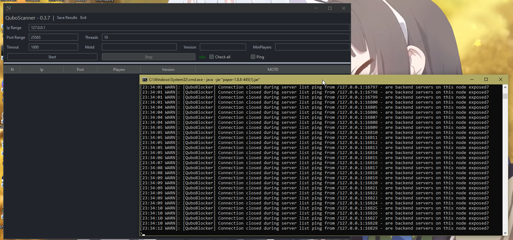
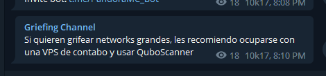
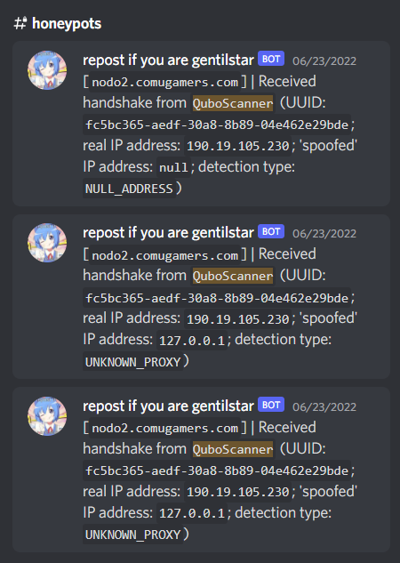

# QuboBlocker
Stop getting your server [QuboScanner](https://github.com/replydev/Quboscanner)'d.

## How it works
It closes your connection when a server list packet is received. Sounds simple, because it is. You don't even need to download any dependency.

## Installation
Download the latest version of the plugin from [the releases page](https://github.com/ComuGamersES/qubo-blocker) and drop it into your `plugins/` folder. Please note that **you may require to upgrade to ProtocolLib 5+** if you have it installed. Get the latest build of it from [here](https://ci.dmulloy2.net/job/ProtocolLib/).

## Building from source
```shell
$ git clone https://github.com/ComuGamersES/qubo-blocker QuboBlocker/
$ cd QuboBlocker/
$ ./gradlew build
```

Get final JAR from `QuboBlocker/build/libs/qubo-blocker-[version].jar`.

## Showcase



## Notes
I always tend to have a reason to make a plugin. This one is not an exception:




